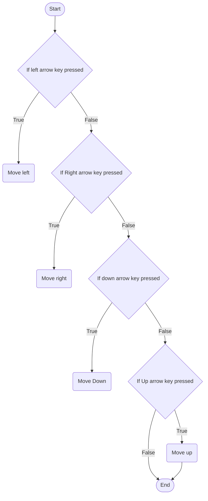
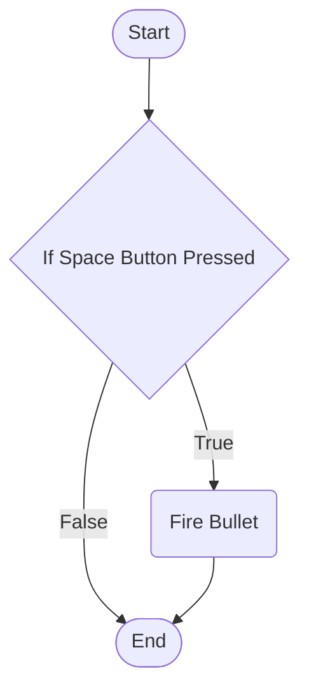

## Movement:

```mermaid
flowchart TD
    terminalStart([Start])
    %% Comment
    terminalEnd([End])
    moveleft(Move left)
    moveright(Move right)
    movedown(Move Down)
    ifup{If Up arrow key pressed}
    ifDownarrow{If down arrow key pressed}
    ifleft{If left arrow key pressed}
    ifright{If Right arrow key pressed}
    moveup(Move up)
    terminalStart --> ifleft
    ifleft --> |True| moveleft
    ifleft --> |False| ifright
    ifright --> |True| moveright
    ifright --> |False| ifDownarrow
    ifDownarrow --> |True| movedown
    ifDownarrow --> |False| ifup
    ifup --> |True| moveup
    ifup --> |False| terminalEnd
    moveup --> terminalEnd
``` 
## Shooting:

```mermaid
flowchart TD
    terminalStart([Start])
    %% Comment
    terminalEnd([End])
    bullet(Fire Bullet)
    PlayerShooting{If Space Button Pressed}
    terminalStart --> PlayerShooting
    PlayerShooting --> |True| bullet
    PlayerShooting --> |False| terminalEnd
    bullet --> terminalEnd
``` 